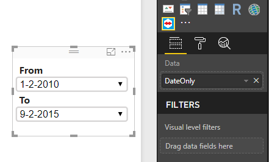
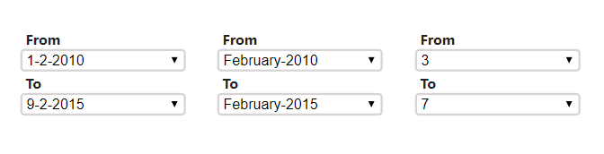
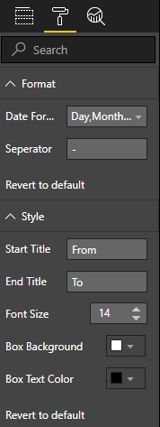

# Range Box Filter
Range Box Filter is a Custom Visual For Power BI provides you with a Range Filter that could be used to filter the results among ranges including (date/numeric)




# Properties 


format section will appear only when the data is of Date Type.

# Date Formats
there is a five available formats:
- Month & Year (M-YYYY)
- Month Name & Year (MMMM-YYYY)
- Day,Month & Year (D-M-YYYY)
- Day,Month Name & Year (D-MMMM-YYYY)
- Year Only

# How to Use
you could download the [.pbiviz file](dist/rangeBoxFilter.pbiviz) or [build it](#how-to-build) ,then import this file into power bi.

# How to Build
to build this visual you need the following :
* [PowerBI-visuals-tools](https://github.com/Microsoft/PowerBI-visuals-tools) .

```
// install PowerBI Visuals Tools
npm install -g powerbi-visuals-tools
```

* clone/download this repo.
* install the required node-modules
```
// note that you need to execute this inside the main folder of the project.
npm update
```
* package the visual
```
pbiviz package
```

# License
this project deployed under [MIT License](LICENSE)
